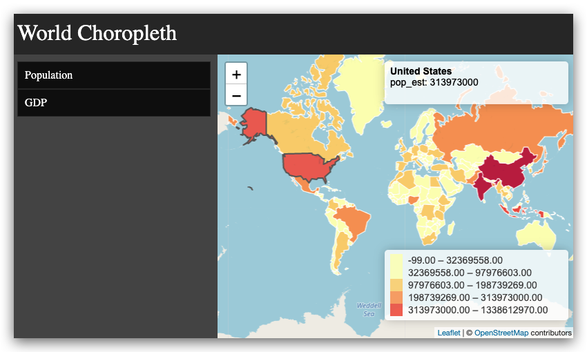

# Introduction to Open Source Web GIS with Leaflet

Research projects are often confronted with the need to publish results to communicate their findings to the general audience. Publishing research on an interactive web-based map is an effective and visually compelling way to do so.

In this workshop, participants will learn the basics of HTML, CSS and Javascript. We will use the Leaflet library to overlay research data and create compelling narrative maps. Finally, participants will learn how to use GitHub Pages as a publishing platform for the interactive maps.

- [class setup instructions](setup.md) (make sure you do this prior to taking the workshop)
