*Note that this session will be recorded.*
## Set up

### Copy the GitHub repo clone link

In your GitHub repo page, copy the clone link:

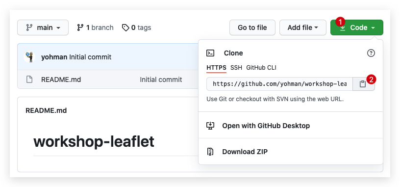

### Set up VSCode

Open VS Code

In your Welcome window, (1) click on the `source control` menu icon on the left, (2) click on `clone repository`, and (3) enter your repo url in the text box.

<kdb>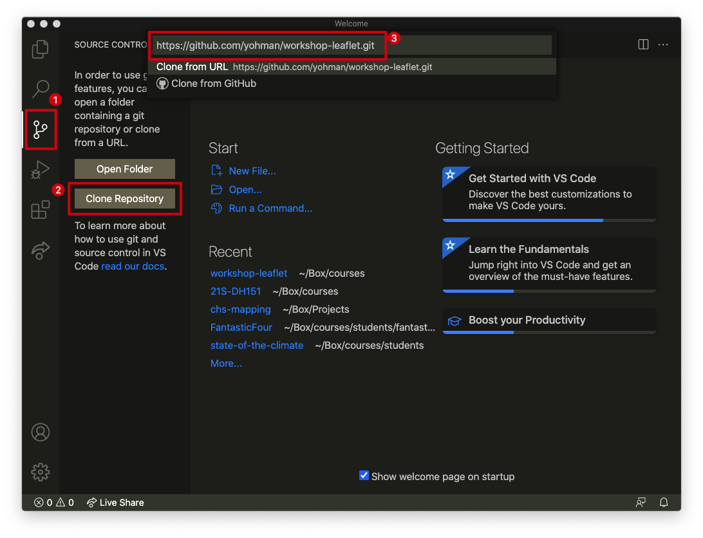</kbd>

You will be asked to choose a location on your hard drive to save the files. If you are prompted to open the repository, do so.

### Install Live Server

Live Server is a great VSCode extension that allows you to see your html code on a local browser window.

1. Click on the extensions tab
1. Enter "live server" in the search box
1. Click on the install button next to Live Server

<kbd>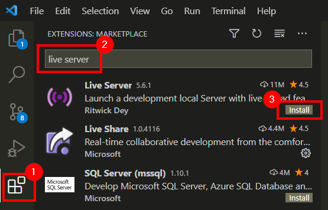</kbd>

Once installed, you will be able to open an .html file, and click on the "go live" button. We will do this shortly, so hang on tight!


## Create your first html page

1. Click on the `File Explorer` tab
1. Click on `New file` icon
1. Enter `index.html` as the file name

<kbd>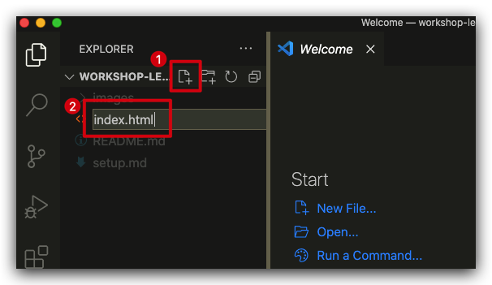</kbd>

The file should popup as an empty tab on the right. Enter (copy and paste) the following code:

```html
<html>
<head>
	<title>Hello World</title>
	<meta charset="utf-8" />

	<!-- style sheets -->
	<link rel="stylesheet" href="css/style.css">

</head>
<body>

	<div class="header">
		Hello World
	</div>
	<div class="sidebar">
		My Sidebar
	</div>
	<div class="content">
		My Map
	</div>
	<div class="footer">
		My Footer
	</div>

	<!-- javascript -->
	<script src="js/map.js"></script>
	
</body>
</html>
```

> What do you observe in the code? 
> 1. Define the three top level elements
> 2. How do you write comments in HTML?
> 3. What do you think is a stylesheet?
> 4. What are classes?

Save the file and open it by clicking on the `Go Live` button as shown below:

<kbd>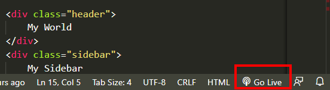

> What do you see in the browser?
> 1. What happens if you change the "Hello World" text to something else?
> 1. Where did your sidebar and content go?

Open the Developer tools as shown below (or Ctrl+Shift+I)

<kbd>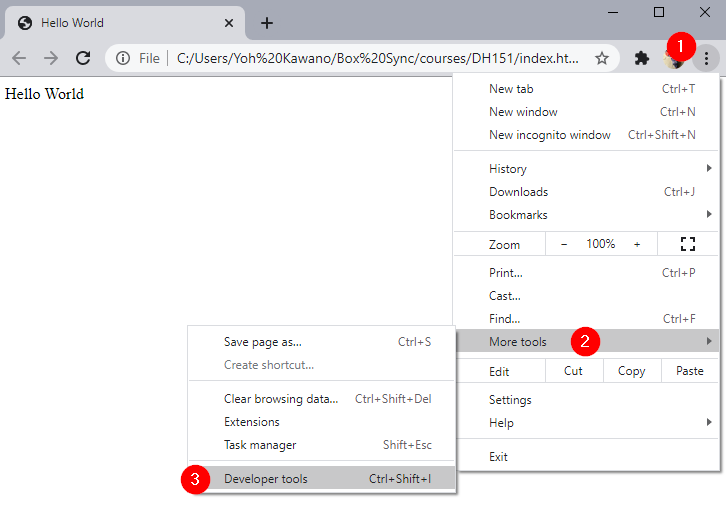</kbd>

Click on the `console` tab

> What do you see in the console?
> How may you fix the error?

## Create a css stylesheet file

As noted, the html code assumes you have a css file named `style.css` and a javascript file named `map.js`. Create the css file first:

1. Click on the create new folder button
1. Name the folder `css`
1. Inside the `css` folder, create a new file named `style.css`

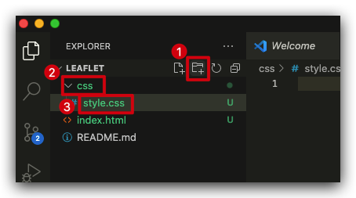

Enter the following code:

```css
body,html {
	margin:0;
	height:100%;
	width:100%;
}

#map {
	height: 100%;
}

body {
	display: grid;
	grid-template-rows: 80px 1fr 50px;
	grid-template-columns: 300px 1fr;
	grid-template-areas: 
	"header header"
	"sidebar content"
	"footer footer";
}

.header {
	grid-area: header;
	padding:10px;
	background-color: #333;
	color: white;
	font-size: 2em;
}

.content {
	grid-area: content;
}

.footer {
	grid-area: footer;
	padding:10px;
	background-color: rgb(175, 175, 175);
}
```

Save the file, and refresh your browser page (if it hasn't done so automatically) that has `index.html`.

> How did the css file affect the page?
> 1. The text in your header is now black on a dark background. Change the text color to white (hint: use `font-color`)
> 1. Choose colors of your liking, and modify the `background-color` values for your `header` and `sidebar`
> 1. Modify the `font-color` appropriately so that there is enough contrast between the text color and the background color.

## Create a javascript file

Similar to the `css/style.css` folder/file, let's create the `js/map.js` file.

1. Create a `js` folder
1. Create a `map.js` file in the `js` folder

Your file structure should look like this:

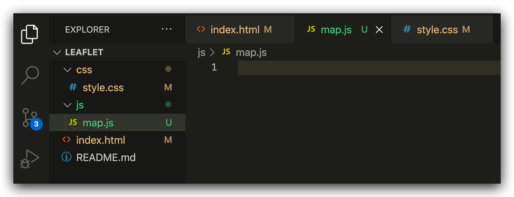

Enter the following javascript code in your `map.js` file, and save it.

```js
alert('hello javascript alert!')
console.log('hello console!')
```

> Save the file, and refresh the page in your browser. 
> 1. What happens?
> 1. Open your developer tools/console window. Do you see your message?

## Map time!

Now it is time to add a map to our html page. This is a multi-step process that entails the following:

1. Bring the leaflet javascript library into the html page
1. Bring the leaflet css into the html page
1. Add a `<div>` to put the map in
1. Add leaflet code to create the map

Take a moment to observe the [leaflet](https://leafletjs.com) website.

### Part 1: Bring in leaflet
We can bring the leaflet javascript and css libraries into our html page using a [cdn](https://leafletjs.com/download.html)

Put the following code in the `<head>` area of your `index.html` file.

```html
<!-- leaflet -->
<link rel="stylesheet" href="https://unpkg.com/leaflet@1.7.1/dist/leaflet.css" />
<script src="https://unpkg.com/leaflet@1.7.1/dist/leaflet.js"></script>
```
> Did you remember to indent your code? Unlike, say, Python, html indentation is not required, but it is always a good idea to keep your code "clean" by following indentation standards throughout your code

### Part 2: Create a map div

Replace the "My Map" text in your `content` div with the following:

```html
<div id="map"></div>
```

### Part 4: Leaflet javascript

Clear your `map.js` file by deleting the alert and console lines. Add the following leaflet "starter" code:

```javascript
var map = L.map('map').setView([34.0697,-118.4432], 17);

L.tileLayer('https://{s}.tile.openstreetmap.org/{z}/{x}/{y}.png', {
	attribution: '&copy; <a href="https://www.openstreetmap.org/copyright">OpenStreetMap</a> contributors'
}).addTo(map);

var marker = L.marker([34.0697,-118.4432]).addTo(map)
		.bindPopup('The Technology Sandbox<br> Where Yoh is sitting this very moment')
		.openPopup();	
```

> ### Make it your own
> Now that you have command over your maproom, modify it and make it your own. Try:
> 1. Change the map marker location to a place of your interest
> 1. Change the popup content
> 1. Add relevant content in the header, sidebar, and footer sections
> 1. Change the colors in the stylesheet, and if you are adventurous, change other stylesheet parameters
> 1. Add more markers to the map, with appropriate popup content

### Push your new files to your GitHub repo

Now that you are satisfied with your _local_ version of your maproom, it is time to add it to your GitHub repo. This will allow you to publish your map to the world!

VS Code comes replete with GitHub features. Let's take full advantage of them. 

1. Click on the `Source Control` tab, check that you have files that have been added/modified (these will be listed under the `Changes` section), and then
1. add a message text for your commit, and
1. commit your changes by clicking on the checkbox icon.

<kbd>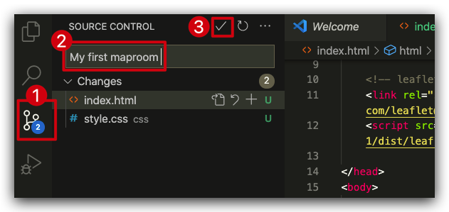</kbd>

There is one step left. You have just commited your changes to your _local_ repo. You need to **push** your changes to your _online_ GitHub repo. 

1. Click on the "more actions" button (triple dot)
1. Click on `Push`

<kbd>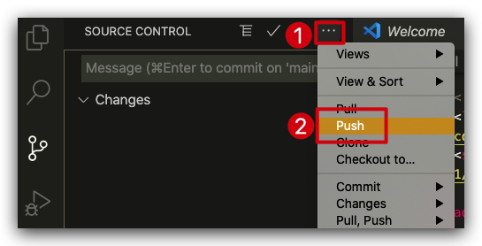</kbd>

## View your website

Go to your GitHub repo page. If your commit was successful, you should see your html, css, and js files there!

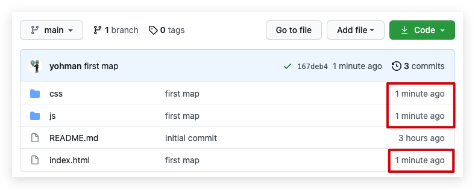

Assuming you have GitHub pages enabled, you should now be able to see your website with a public URL. Change the url below to match your own GitHub pages url.

*Note that it may take a minute or two after you commit your files for them to be available on GitHub pages.*


### Bonus: Using the Terminal to push

If you prefer to use the terminal to do your git commands (instead of the GUI interface provided by VS Code), then the following commands will push your changes to your repository.

1. In VS Code's menu bar, go to `Terminal`, `New Terminal`
1. Check that you are in the right place:
	```PowerShell
	git status
	```
1. Add modified/new files to your staging area:
	```PowerShell
	git add .
	```
1. Commit your files with a message:
	```PowerShell
	git commit -m "maproom changes"
	```
1. Push your changes to your repo:
	```PowerShell
	git push
	```

## Part 2: Javascript basics


In your Chrome browser, you should now see your index.html file with a fully interactive leaflet map.

When loading a web page which is associated with one or more scripts, the JavaScript code is automatically interpreted and executed by the browser. We can also manually interact with the browser’s interpreter or engine using the JavaScript console, also known as the command line, which is built into all modern web browsers. The console is basically a way to type code into a computer and get the computer’s answer back. This is useful for experimenting with JavaScript code, such as quickly testing short JavaScript code snippets. It is exactly what we are going to do.

### Developer's tools

Open the developer's tools (ctrl-shift-i) and select the console tab.

Enter the following javascript code (feel free to change the message):

```js
alert('I love Javascript')
```
<kbd>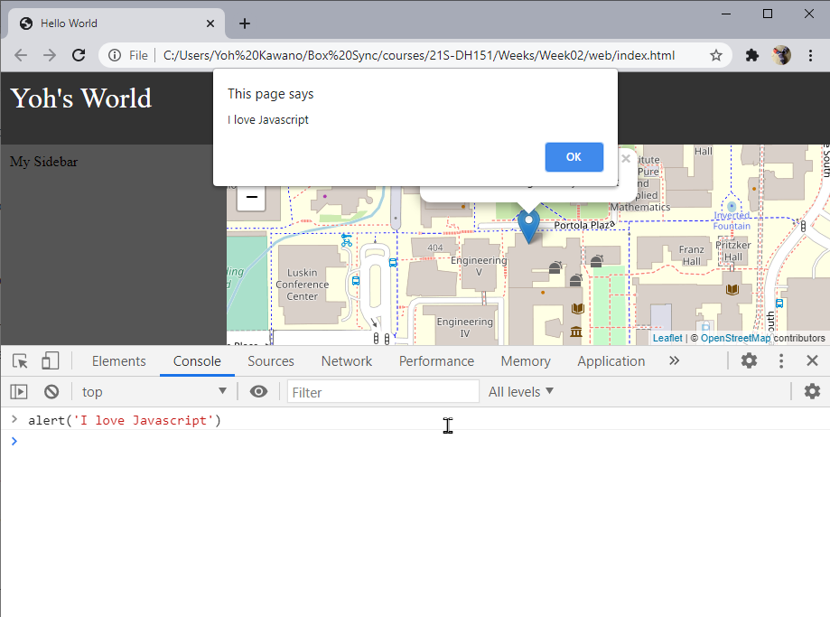</kbd>

How about some math:

```js
1 + 1
```

>Experiment with other arithmetic features. What can and can it not do?

### Variables

Variables can be declared in three ways.

```js
var d1 = "I am a var variable, and I am old school";
let d2 = "I am a let variable, the new and cool way to define variables";
const d3 = "I am a const variable, and you can't change me";
```


### Data types

#### Strings: Single or double quotes

```js
let s1 = 'Mapping' // I am a string
let s2 = 'is fun' // I am also a string
```

Concatenation

```js
s1 + s2
```

> This results in `Mappingis fun`. How do you fix the sentence?


Adding to existing strings
```js
html = '<h1>My Map</h1>'
html += '<ul>'
html += '<li>Osaka</li>'
html += '<li>Bangkok</li>'
html += '<li>Tokyo</li>'
html += '<li>Los Angeles</li>'
html += '</ul>'
```

#### Numbers

```js
let x = 10;
let y = 3;
```
Variables can do math too!
```js
x*y
```

> Question: What happens when you add a string to a number? (ex. `s1 + x`)


#### Arrays: Square brackets `[]`

```js
let cities = ['Osaka','Bangkok','Tokyo','Los Angeles']
```
How many values (length)?
```js
cities.length
```
Getting specific array values. Note that array count begins with "0" and not "1"
```js
cities[0]
cities[1]
cities[2]
cities[3]
```
#### Objects: Squiggly brackets `{}`
A javascript object is a great way to store a collection of data in `key:value` pairs.

```js
let city = {
	'title':'Hello Osaka',
	'lat': 34.6937,
	'lon': 135.5023
};
```

Grab "values" by requesting its key:

```js
city.title
```


#### Objects in Arrays
By putting objects with identical key:value pairs, we can begin to construct a data table.
```js
let data = [
	{
		'title':'Osaka',
		'lat': 34.6937,
		'lon': 135.5023
	},
	{
		'title':'Cali',
		'lat': 3.4516,
		'lon': -76.5320
	},
	{
		'title':'Bangkok',
		'lat': 13.7563,
		'lon': 100.5018
	},
	{
		'title':'Tokyo',
		'lat': 35.6762,
		'lon': 139.6503
	},
	{
		'title':'LA',
		'lat': 34.0522,
		'lon': -118.2437
	}
]
```

Challenge questions:
1. How do you get specific array objects?
1. Get the latitude coordinate for Tokyo using javascript code

### Loops

Looping allows you to *iterate* through an array.

Loop through an array:

```js
// loop through cities
cities.forEach(function(item){
	console.log(item)
});
```

Loop through an array of objects:
```js
// loop through data
data.forEach(function(item){
	console.log(item)
});
```

You can choose to return *specific* elements from each data object.

```js
// loop through data
data.forEach(function(item){
	console.log('The latitude for ' + item.title + ' is ' + item.lat)
});
```

### Adding markers with a loop

Now that we have the basics of javascript loops down, we can utilize it to generate multiple markers at once.

At the very top of your `map.js` file, add the code that generates the data that consists of objects within an array. We will name this section of our code `globals`. Feel free to change the title and locations to areas of interest to you:

```js
// globals
let data = [
	{
		'title':'Osaka',
		'lat': 34.6937,
		'lon': 135.5023
	},
	{
		'title':'Cali',
		'lat': 3.4516,
		'lon': -76.5320
	},
	{
		'title':'Bangkok',
		'lat': 13.7563,
		'lon': 100.5018
	},
	{
		'title':'Tokyo',
		'lat': 35.6762,
		'lon': 139.6503
	},
	{
		'title':'LA',
		'lat': 34.0522,
		'lon': -118.2437
	}
]
```

Next, modify the marker code by wrapping it within a loop:


```js
// loop through data
data.forEach(function(item){
	// add marker to map
	let marker = L.marker([item.lat,item.lon]).addTo(map).bindPopup(item.title)
})
```

### Using a `featureGroup` for your markers

Currently, we are mapping each marker, one at a time. Since our markers are part of a collection, it is adviced to put them in a leaflet `featureGroup` [link](https://leafletjs.com/reference-1.7.1.html#featuregroup).

First, add the `featureGroup` variable in the `globals` section:

```js
let myMarkers = L.featureGroup();
```

Next, modify the `forEach` loop by adding the marker to the `featureGroup` and then, adding the `featureGroup` to the map.

```js
// loop through data
data.forEach(function(item){
	// create marker
	let marker = L.marker([item.lat,item.lon]).bindPopup(item.title)

	// add marker to featuregroup
	myMarkers.addLayer(marker)

})

// after loop, add the FeatureGroup to map
myMarkers.addTo(map)
```

### Zoom to the extent of your markers

The final step to complete the first version of your maproom is to zoom to the extent of your markers. Leaflet comes with some handy geospatial functions, one of which calculates the boundary extent of your featuregroup. You can add the following to the end of your code to zoom to the extent of your markers:

```js
// zoom to the extent of all markers
map.fitBounds(myMarkers.getBounds())
```

## Add jQuery

What is [jQuery](https://jquery.com/)?
> jQuery is a fast, small, and feature-rich JavaScript library. It makes things like HTML document traversal and manipulation, event handling, animation, and Ajax much simpler with an easy-to-use API that works across a multitude of browsers. With a combination of versatility and extensibility, jQuery has changed the way that millions of people write JavaScript.

Add jQuery (v3.6.0 at the time of this writing) using the CDN (link provided [here](https://code.jquery.com/)) to the `<head></head>` area of your `index.html` file.

```html
<!-- jquery -->
<script src="https://code.jquery.com/jquery-3.6.0.min.js" integrity="sha256-/xUj+3OJU5yExlq6GSYGSHk7tPXikynS7ogEvDej/m4=" crossorigin="anonymous"></script>
```

### Selecting elements
jQuery makes it easy to select elements (like a `<div>`) and do *something* with it. Let's experiment using your browser's developer tools.
1. Open `index.html` in a chrome browser (if you installed the "Live Server" extension, you can click on the "Go Live" button)
1. Access the developer tools (ctrl/command+shift+i), and select the console tab

#### Selecting elements by class name

Our `index.html` file has elements with `class` attributes in them. A `class` is a way to identify an element in your website. You should have div's with the following `class` attributes:
- header
- sidebar
- content

Let's do some magic. Note that selecting a class element uses the dot `.` notation:

```js
$('.header').hide()
```
Wow! Now take a wild guess, and figure out how to bring the header back.

```js
$('.header').show()
```

Try these other fun ones:

```js
$('.header').fadeOut()
```
```js
$('.header').fadeIn()
```
You can also manipulate the content.
```js
$('.header').prepend('Hello!')
```
```js
$('.header').append('Goodbye!')
```
```js
$('.header').html("I'm a brand <b>new</b> header!")
```
Try these functions on the sidebar as well.

#### Selecting elements by id
Your `index.html` file has one div with an `id` attribute:
- map

Selecting an element by id uses a hashtag `#` notation:

```js
// fade out slowly, like 1000 milliseconds
$('#map').fadeOut(1000)
```
```js
// fade in slowly, like 2000 milliseconds
$('#map').fadeIn(2000)
```

> **NOTE**: Remember, `.` for classes, and `#` for ids. This notation is the same for stylesheet declarations, which we will cover later.

### Adding dynamic content to the sidebar

<kbd>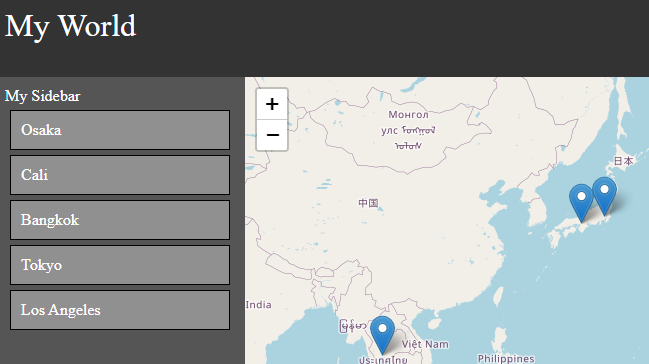</kbd>

So how is all this useful for our maproom? While we learned how to add markers from an array of objects, we can use the same logic to add content to the sidebar.

You should have a loop in your code that looks like this:

```js
// loop through data
data.forEach(function(item){
	// create marker
	let marker = L.marker([item.lat,item.lon]).bindPopup(item.title)

	// add marker to featuregroup
	myMarkers.addLayer(marker)
})
```

You can use this same loop to add content to the sidebar:

```js
// loop through data
data.forEach(function(item){
	// create marker
	let marker = L.marker([item.lat,item.lon]).bindPopup(item.title)

	// add marker to featuregroup
	myMarkers.addLayer(marker)

	// add data to sidebar
	$('.sidebar').append(item.title)
})
```

Notice how `.append` adds the title of each location to the sidebar, but it does not consider text spacing, new lines, or layout. 

Let's create a "card" like style for each item in the sidebar. To do so, wrap the content in a `<div></div>` container, adding a class attribute `class="sidebar-item"` so that we can style it later. Also notice how we are concatenating string values with variables (yes, it's getting complicated):

```js
// loop through data
data.forEach(function(item){
	// create marker
	let marker = L.marker([item.lat,item.lon]).bindPopup(item.title)

	// add marker to featuregroup
	myMarkers.addLayer(marker)

	// add data to sidebar
	$('.sidebar').append('<div class="sidebar-item">'+item.title+'</div>')
})
```

### Create new css entry

Next, we need to create a css entry in our stylesheet to style our divs with class `sidebar-item`.

Add the following css in your `Week3/css/style.css` file:

```css
.sidebar-item {
    padding: 10px; /* adds inner padding */
    background: gainsboro; /* background color */
    border: 1px solid gray; /* border width, style, and color */
    margin: 5px; /* outer padding */
}
```
Refresh your page in your browser to see your new css style applied to the sidebar elements. Take some time to adjust the css components to match your site design and layout.


# Building a data driven maproom

In the previous section, we created our own data using javascript objects. Here, we will learn how to import data from a csv file.

### Cleaning up your maproom

Before we begin, let's clean up your `map.js` file. To make things easy, replace your code with the following "starter" code:

```js
// Global variables
let map;

// initialize
$( document ).ready(function() {
    createMap();
});

// create the map
function createMap(){
	map = L.map('map').setView([0,0],3);

	L.tileLayer('https://{s}.tile.openstreetmap.org/{z}/{x}/{y}.png', {
		attribution: '&copy; <a href="https://www.openstreetmap.org/copyright">OpenStreetMap</a> contributors'
	}).addTo(map);
}
```

This should get rid of the markers and default to a world map. 

Notice that there is now an `initialize` section, which tells your javascript to do something once the document is loaded in the browser.

Next, notice that the code to create a map is now wrapped around a function called `createMap()`. While we will not be covering functions in detail in this workshop, note that functions allow you to group code together where you can call it with a single line of code, or, using a function call.

To review, this code now does the following:

1. has a section that defines global variables
1. has an initializer that happens when the page loads
1. has a function that is called from the initializer that creates an interactive world map

### Import PapaParse

CSV is not natively supported by javascript. In order to import CSV, we will use an open source in-browser CSV parser library called [PapaParse](https://www.papaparse.com/).

To use PapaParse, download the source js file, and save it in your `js` folder:

- https://unpkg.com/papaparse@5.3.0/papaparse.min.js

Then, add the file to your `index.html` file in the header section:

```html
<script src="js/papaparse.min.js"></script>
```
> **Question:** Why download the file when you can link to it remotely?

### Create a csv file

Create a `data` folder. Download and add the `dunitz.csv` file from [here](https://raw.githubusercontent.com/yohman/21S-DH151/main/Weeks/Week04/Lab/data/dunitz.csv).

### Create a `readCSV()` function

First, add the path as a global variable in the `//global variable` section of `map.js`.

```js
// path to csv data
let path = "data/dunitz.csv";
```

Next, create a function that will read the csv file using PapaParse. You can put the function under the `createMap` function.

```js
// function to read csv data
function readCSV(path){
	Papa.parse(path, {
		header: true,
		download: true,
		complete: function(data) {
			console.log(data);
			
			// map the data
			mapCSV(data);

		}
	});
}
```
Finally, add the call to the newly created `readCSV(path)` function inside the initialize code, right after the `createMap()` call:

```js
// initialize
$( document ).ready(function() {
	createMap();
	readCSV(path);
});
```

Open the developer's tools and checkout the console output. How is the data structured?

### Sidenote about hosting csv files on GitHub

Note that the path can lead to a local file via a relative path, or it can be a csv file hosted on the web, like on a github account. If you are linking to a csv file on a GitHub account ([example](https://github.com/yohman/21S-DH151/blob/main/Weeks/Week04/Lab/data/dunitz.csv)), make sure you link to the raw url link:

<kbd>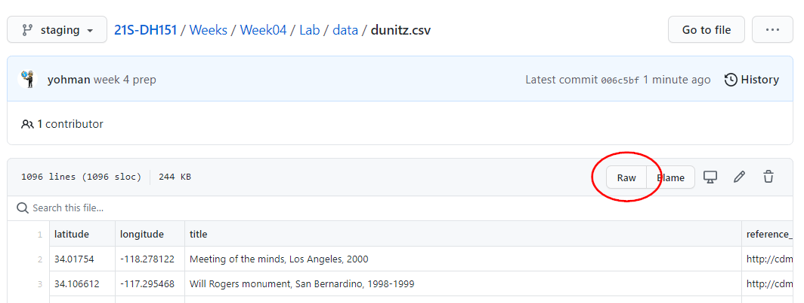</kbd>

### Create the function to map the csv data

Notice that the `readCSV` function ends with a call to yet another function `mapCSV()`, hence, creating an error in your console because it is asking for a function that does not exist. So let's create the `mapCSV()` function, that takes in the data from the csv file, creates a marker for each element, and maps it.

First, we need to create a global variable for our featuregroup. Why? Note that variables created *within* a function are only available *within* that function and cannot be accessed outside of it. Therefore, if you create the variable as a global variable, it can be accessed within any other function you create.

In the global variables area up top, add the following entry:

```js
// global variables
let markers = L.featureGroup();
```

Next, create the `mapCSV` function:

```js
function mapCSV(data){
	
	// loop through each entry
	data.data.forEach(function(item,index){
		// create marker
		let marker = L.marker([item.latitude,item.longitude])

		// add marker to featuregroup
		markers.addLayer(marker)
	})

	// add featuregroup to map
	markers.addTo(map)

	// fit markers to map
	map.fitBounds(markers.getBounds())
}
```
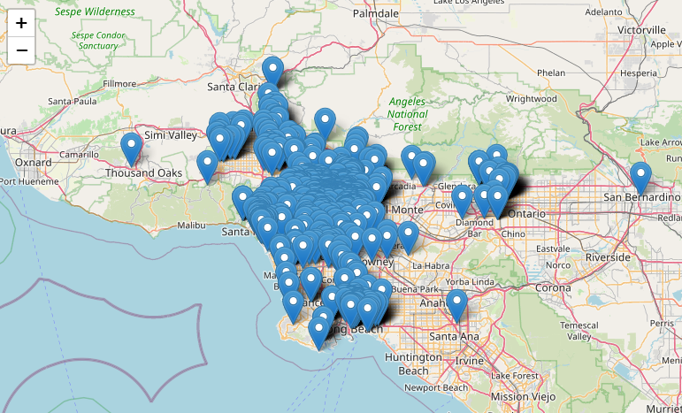

### Changing markers to circles

The icon marker is now overcrowding the map. While you can design your own icons, another option is to use `circleMarker`.

- [CircleMarker documentation](https://leafletjs.com/reference-1.7.1.html#circlemarker)

```js
function mapCSV(data){
	
	// circle options
	let circleOptions = {
		radius: 5,
		weight: 1,
		color: 'white',
		fillColor: 'dodgerblue',
		fillOpacity: 1
	}

	// loop through each entry
	data.data.forEach(function(item,index){
		// create marker
		let marker = L.circleMarker([item.latitude,item.longitude],circleOptions)

		// add marker to featuregroup		
		markers.addLayer(marker)
	})

	// add featuregroup to map
	markers.addTo(map)

	// fit markers to map
	map.fitBounds(markers.getBounds())
}
```
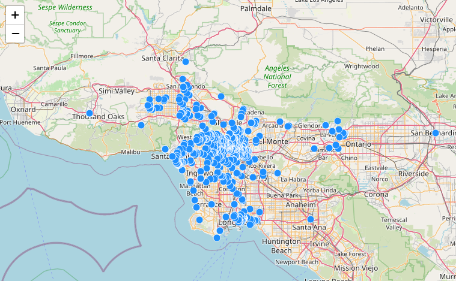

### Adding on hover event (instead of on click)

```js
function mapCSV(data){

	// circle options
	let circleOptions = {
		radius: 5,
		weight: 1,
		color: 'white',
		fillColor: 'dodgerblue',
		fillOpacity: 1
	}

	// loop through each entry
	data.data.forEach(function(item,index){
		// create a marker
		let marker = L.circleMarker([item.latitude,item.longitude],circleOptions)
		.on('mouseover',function(){
			this.bindPopup(`${item.title}<br>`).openPopup()
		})

		// add marker to featuregroup
		markers.addLayer(marker)
	})

	// add featuregroup to map
	markers.addTo(map)

	// fit map to markers
	map.fitBounds(markers.getBounds())
}
```
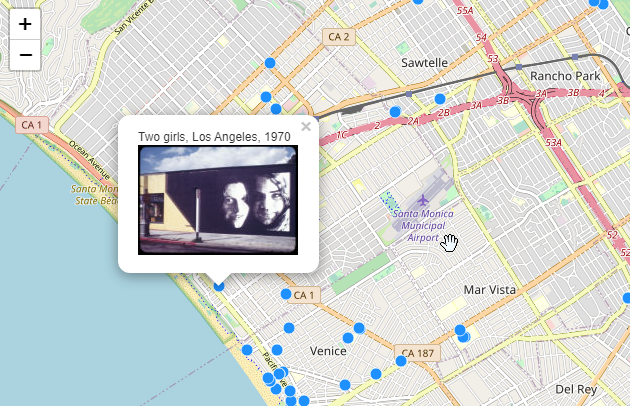

### Add images to sidebar

Below, notice the code added within the `forEach` loop that adds the thumbnail image to the sidebar, along with a function to pan to it.

```js
function mapCSV(data){

// circle options
	let circleOptions = {
		radius: 5,
		weight: 1,
		color: 'white',
		fillColor: 'dodgerblue',
		fillOpacity: 1
	}

	// loop through each entry
	data.data.forEach(function(item,index){
		// create a marker
		let marker = L.circleMarker([item.latitude,item.longitude],circleOptions)
		.on('mouseover',function(){
			this.bindPopup(`${item.title}<br>`).openPopup()
		})

		// add marker to featuregroup
		markers.addLayer(marker)

		// add entry to sidebar
		$('.sidebar').append(``)
	})

	// add featuregroup to map
	markers.addTo(map)

	// fit map to markers
	map.fitBounds(markers.getBounds())
}
```

Images are now in the sidebar with a call to a new function to pan to the image. Notice that the `panTo` function, unlike the `flyTo` function, does not include a zoomlevel option, so it has to be defined as a separate line of code.

```js
function panToImage(index){
	// zoom to level 17 first
	map.setZoom(17);
	// pan to the marker
	map.panTo(markers.getLayers()[index]._latlng);
}
```